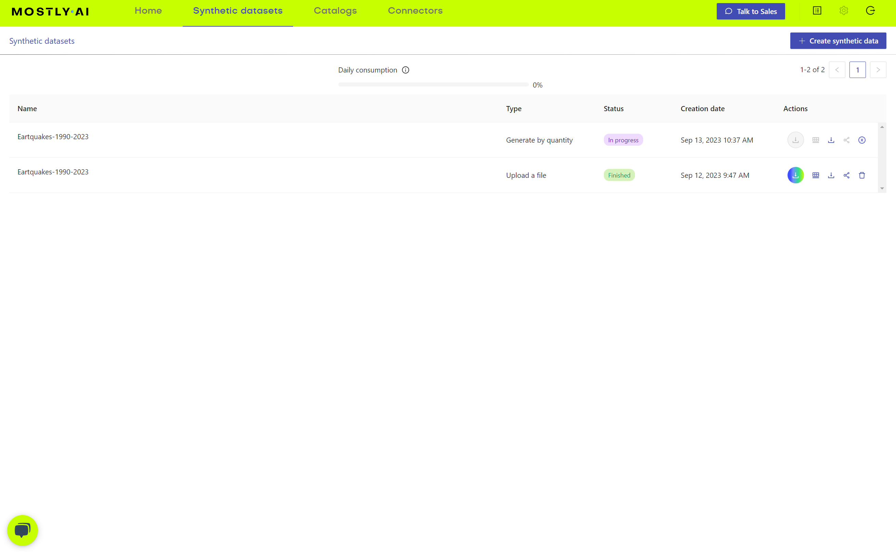
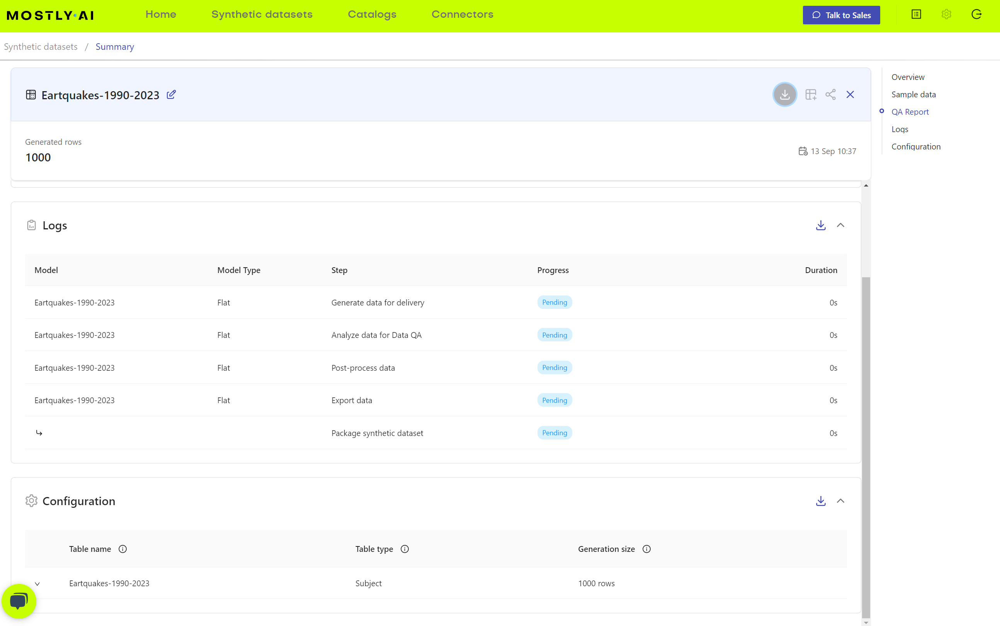
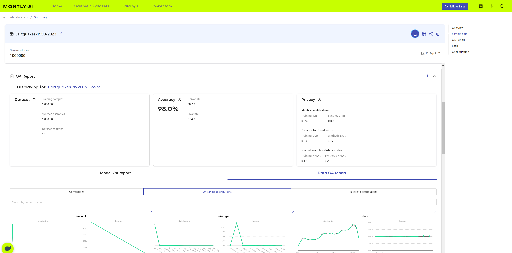
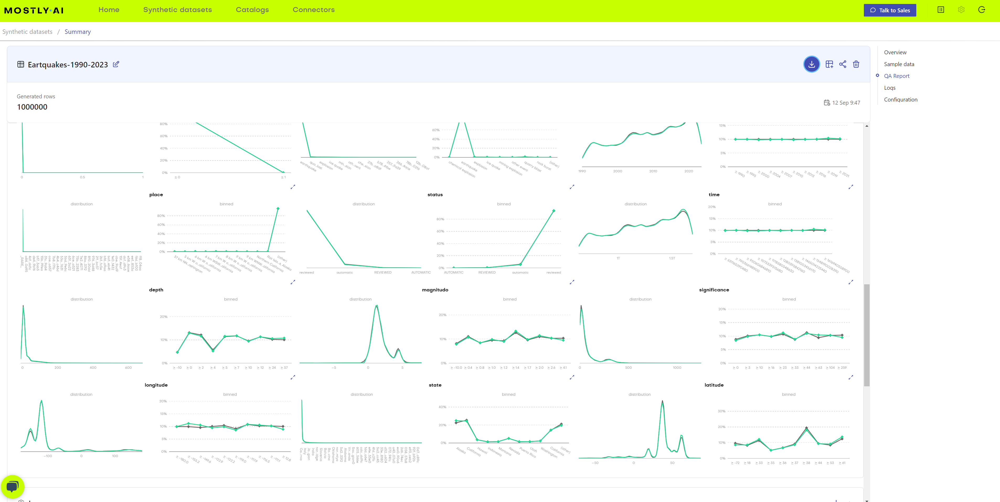
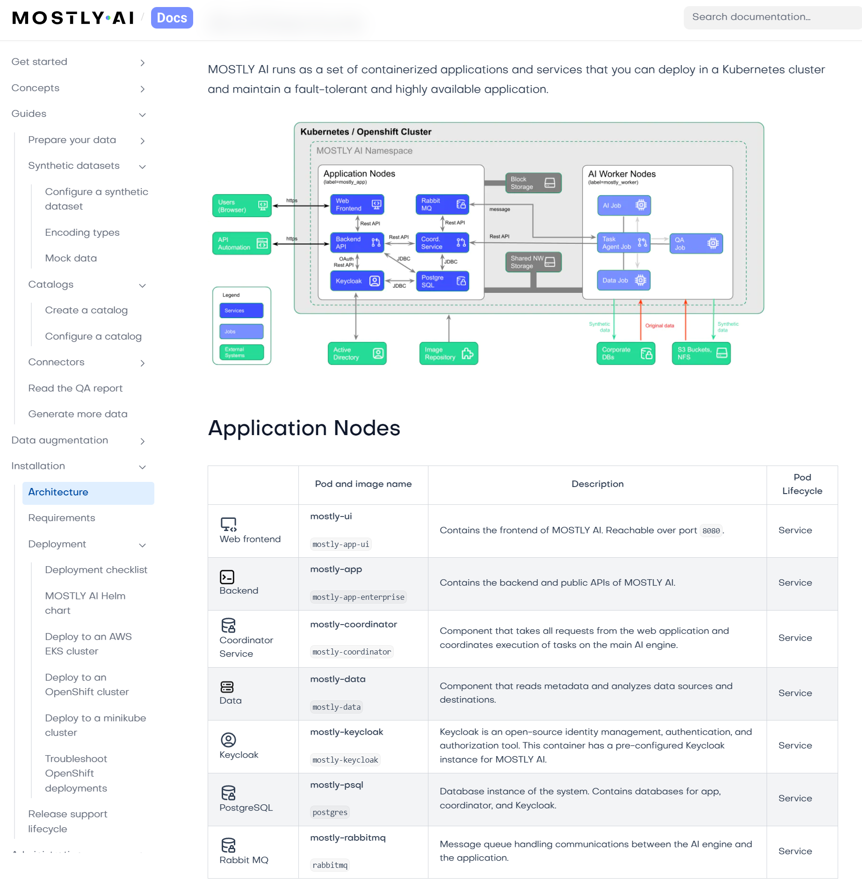

# Mostly.ai

Mostly AI is an AI based generator of synthetic data. It is a commercial product that is available as a cloud service or as an on-premises solution.

## User Interface

### Highlights
 - Mostly.ai has an intuitive user interface
 - It does not have an API or CLI.
 - It's documentation is well written.

### UI Walk through / overview

When you log in you're greeted with a home page that lets you generate a data source by uploading a CSV or configuring a connector.
<br><br>

Here is a screenshot showing some of the avaialble connectors.
<br><br>

When you create a dataset there are various configuration options on how to generate the data. 

Once you generate data the synthetic datasets will show up in a table found in the synthetic datasets tab.
<br><br>

From a synthetic dataset you can generate more data.
<br><br>

You get a reasonable log that updates live as the data is generated.
<br><br>

Once the data is generated a detailed QA report is provided.
<br><br>
<br><br>


## Deployment Options

Several on prem deployment options are available.

 - OpenShift
 - AWS EKS
 - Minikube

Included in the deployment documentation is an architecture overview. The documentation appears to be well written.

<br><br>


## Testing

A simple confidence test of Mostly.ai's synthetic data generation. Here we upload a CC0 dataset from Kaggle on
earthquakes and have the app generate some data for us. We then assert that the data seems correct by taking a random
sample and doing some basic checks, we also assert that a random selection of rows in the synthetic data do not exist 
in the original data set. See the included python script for details.

Kaggle data reference: https://www.kaggle.com/datasets/alessandrolobello/the-ultimate-earthquake-dataset-from-1990-2023

Example run

```bash

$ python test_data.py
Selecting random sample from Eartquakes-1990-2023-synthetic.csv of 1000 rows
Asserting data is withing acceptable limits
Selecting 10 random rows from sample and asserting that it isn't in the original data source
Executing: grep -n '1380454490148.*_RARE_.*reviewed.*0.*50.*earthquake.*1.81531673.* Alaska.*-138.37935893.*58.70603081.*19.15651954.*2013-09-01 23:24:44.082' Eartquakes-1990-2023.csv
Executing: grep -n '1653309219429.*3 km WNW of Walker, California.*reviewed.*0.*56.*earthquake.*1.91419166.* California.*-119.48060344.*38.47083244.*5.65072347.*2022-08-22 17:24:15.433' Eartquakes-1990-2023.csv
Executing: grep -n '1433223911162.*11 km NNE of New Pine Creek, Oregon.*reviewed.*0.*2.*earthquake.*0.40434871.* Oregon.*-120.06041295.*42.77575956.*4.77629474.*2015-05-24 23:37:44.758' Eartquakes-1990-2023.csv
Executing: grep -n '1186299280472.*24 km NW of San Simeon, California.*reviewed.*0.*72.*earthquake.*2.17360229.* California.*-121.18967537.*35.76906528.*4.41126049.*2007-08-11 20:36:23.490' Eartquakes-1990-2023.csv
Executing: grep -n '633565111469.*_RARE_.*reviewed.*0.*30.*earthquake.*1.40350613.*California.*-117.15069994.*35.88275654.*5.13619692.*1990-03-05 13:16:52.620' Eartquakes-1990-2023.csv
Executing: grep -n '1214093100314.*Gulf of Alaska.*reviewed.*0.*141.*earthquake.*3.0793328.*Gulf of Alaska.*-148.64365141.*57.0109145.*10.08785172.*2008-05-26 21:39:23.830' Eartquakes-1990-2023.csv
Executing: grep -n '1345711223382.*_RARE_.*reviewed.*0.*137.*earthquake.*2.95344421.* Alaska.*-173.85952542.*50.95739669.*13.64237398.*2012-10-29 01:22:39.606' Eartquakes-1990-2023.csv
Executing: grep -n '1414275200742.*4 km WNW of Cobb, California.*automatic.*0.*14.*earthquake.*0.94977739.* California.*-122.77236171.*38.84387943.*2.44056081.*2014-12-12 08:42:09.610' Eartquakes-1990-2023.csv
Executing: grep -n '737744821423.*_RARE_.*reviewed.*0.*35.*earthquake.*1.45438692.* California.*-115.42798759.*33.43453439.*5.89557798.*1993-05-10 22:49:15.110' Eartquakes-1990-2023.csv
Executing: grep -n '1542625638923.*12km ENE of Borrego Springs, CA.*reviewed.*0.*24.*earthquake.*1.25232497.*California.*-116.22738166.*33.36404963.*9.82444695.*2018-09-23 15:12:58.150' Eartquakes-1990-2023.csv

```