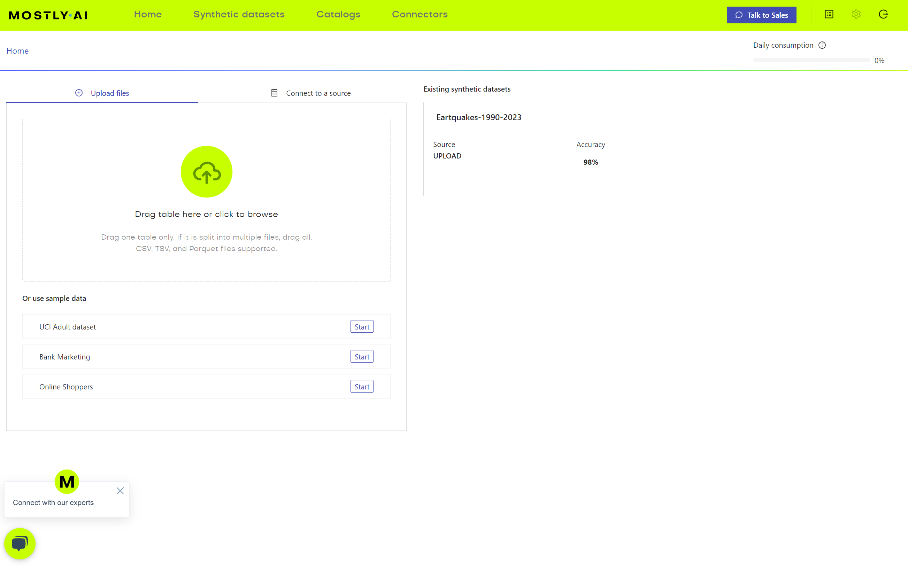
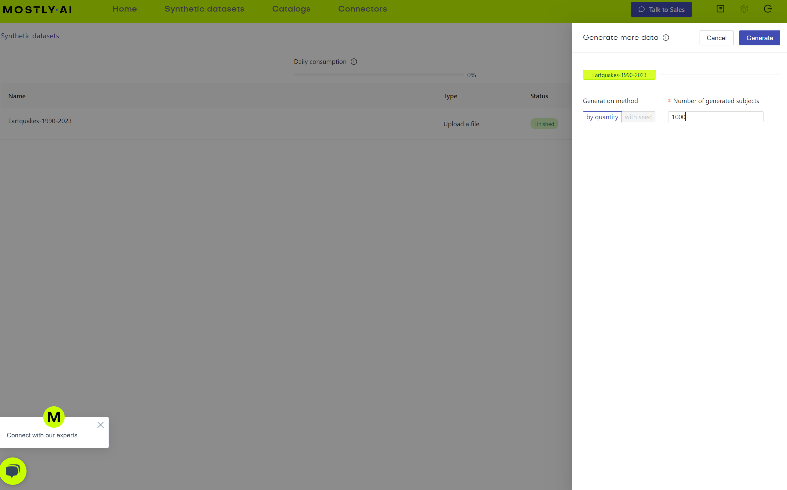

# Mostly.ai

Mostly AI is an AI based generator of synthetic data. It is a commercial product that is available as a cloud service or as an on-premises solution.

## User Interface

### Highlights
 - Mostly.ai has an intuitive user interface
 - It does not have an API or CLI.
 - It's documentation is well written.

### Walk through / overview

When you log in you're greeted with a home page that lets you generate a data source by uploading a CSV or configuring a connector.

Here is a screenshot showing some of the avaialble connectors.

When you create a dataset there are various configuration options on how to generate the data. 

Once you generate data the synthetic datasets will show up in a table found in the synthetic datasets tab.

From a synthetic dataset you can generate more data.

You get a reasonable log that updates live as the data is generated.

Once the data is generated a detailed QA report is provided.

## Deployment Options

Several on prem deployment options are available.

 - OpenShift
 - AWS EKS
 - Minikube

Included in the deployment documentation is an architecture overview. The documentation appears to be well written.

