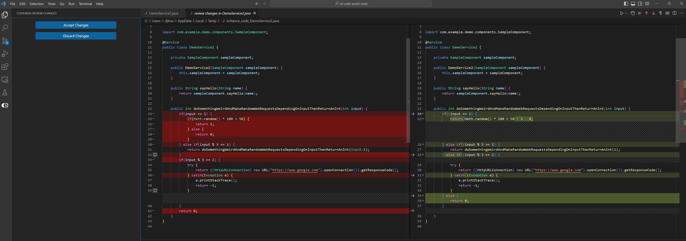

# Codium

Codium is a new coding assistant that has started it's focus on explaining, improving, and testing existing code. With
an intuitive it's worth considering.

### Explaining Code

Here are some screen shots showing codium explaing various code segments. Simply select the code you want it to explain
and then click `Explain the code`. As can be seen in the screenshots codium is able to accurately explain unusual and
complex code.
 

 

### Improving Code

Similar to explaining the code, segments of code can be selected for improvement suggestions. Suggestions are presented
similar to a view of a git diff. Many suggestions where good in the tested code, however there was one case where a
suggestion introduced an infinite loop. Suggestions come with detailed explainations in addition to code changes.

 

 

### Testing

To generate test simply select the code to test. A view will pop up containing several useful features. First a 
configuration panel where you can select the test framework and change other settings related to testing, this works
with Java and Python. Next is a behavioral description of useful test cases, this works for at least Java, Python, and
Kotlin. Finally is test cases. For each test case there's an optional chat to adjust the tests if needed.

Additionally there is a code explaination tab and a code suggestion tab that provides the same information as the 
explain code and improve code features documented above.

 

 

If there's ever an issue with the tests you can click `regenerate tests`
 

 
