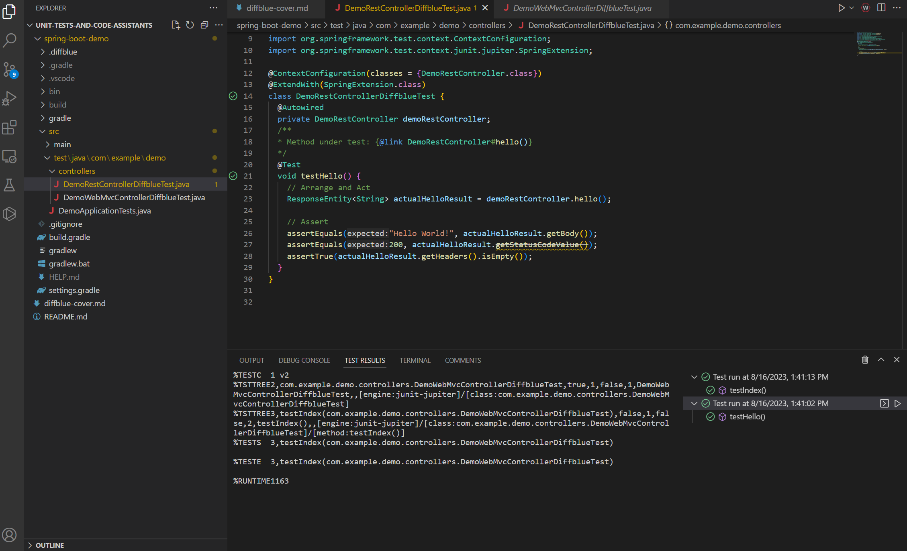

An Evaluation of Diffblue Cover
================================================

* An initial test of the diffblue cover cli
* Testing coverage of more complicated methods
* Notable features and gaps
* Overall impressions


An initial test of the diffblue cover cli
------------------------------------------------
```cmd
C:\Users\djkno\projects\openai-tests\unit-tests-and-code-assistants\spring-boot-demo>dcover create com.example.demo.
INFO  Diffblue Cover 2023.08.01-4f16663-licensed
INFO
INFO  Detecting environment:
INFO  ----------------------
INFO  Detected Java version 17.0.8
INFO  Selected build system: Gradle
INFO  Selected classpath from build system Gradle
INFO  Selected test framework: JUnit Jupiter
INFO  Selected Java language compliance level: 17
INFO  Prefixes for filtering classes/methods:
INFO  - com.example.demo.
INFO  Gathering methods to test...
ERROR E054: No class files found
      Diffblue Cover could not find any .class files for your project. This
      usually means that your project has not yet been compiled.
      Please run `gradle build` from the root of your project to ensure the project
      is compiled, and all tests pass.
      Depending on your project setup, additional configuration may be required.
      See https://diff.blue/E054 for further information on how to compile your
      project and configure Diffblue Cover for validating your tests.
ERROR E004: No methods found to test
      Please ensure the project has been built, that any specified entry points
      exist, and that the patch (if given) is valid.
      See https://diff.blue/E004 to resolve this issue.
INFO  Log file: C:\Users\djkno\projects\openai-tests\unit-tests-and-code-assistants\spring-boot-demo\.diffblue\log\user-20230816T133609.log
INFO  Finished in 20s
```


```cmd
C:\Users\djkno\projects\openai-tests\unit-tests-and-code-assistants\spring-boot-demo>gradlew build

Welcome to Gradle 8.2.1!

Here are the highlights of this release:
 - Kotlin DSL: new reference documentation, assignment syntax by default
 - Kotlin DSL is now the default with Gradle init
 - Improved suggestions to resolve errors in console output
 - Reduced sync memory consumption

For more details see https://docs.gradle.org/8.2.1/release-notes.html


> Task :test
OpenJDK 64-Bit Server VM warning: Sharing is only supported for boot loader classes because bootstrap classpath has been appended

Deprecated Gradle features were used in this build, making it incompatible with Gradle 9.0.

You can use '--warning-mode all' to show the individual deprecation warnings and determine if they come from your own scripts or plugins.

For more on this, please refer to https://docs.gradle.org/8.2.1/userguide/command_line_interface.html#sec:command_line_warnings in the Gradle documentation.

BUILD SUCCESSFUL in 9s
7 actionable tasks: 7 executed
```

```cmd
C:\Users\djkno\projects\openai-tests\unit-tests-and-code-assistants\spring-boot-demo>dcover create com.example.demo.
INFO  Diffblue Cover 2023.08.01-4f16663-licensed
INFO
INFO  Detecting environment:
INFO  ----------------------
INFO  Detected Java version 17.0.8
INFO  Selected build system: Gradle
INFO  Selected classpath from build system Gradle
INFO  Selected test framework: JUnit Jupiter
INFO  Selected Java language compliance level: 17
INFO  Selected test validation: enabled
INFO  Prefixes for filtering classes/methods:
INFO  - com.example.demo.
INFO  Gathering methods to test...
INFO  Found 6 callable methods in 3 classes
INFO
INFO  Creating tests:
INFO  ---------------
INFO  [1/3] com.example.demo.DemoApplication
INFO  [1/3]   Tests created: 0
INFO  [2/3] com.example.demo.controllers.DemoRestController
INFO  [2/3]   Tests created: 1
INFO  [3/3] com.example.demo.controllers.DemoWebMvcController
INFO  [3/3]   Tests created: 1
INFO
INFO  Summary:
INFO  --------
INFO  Total:                                               6 methods
INFO  2 tests created for:                                 2 methods
INFO
INFO  Tested indirectly via other methods:                 3 methods
INFO      3 T005: Trivial constructor
INFO  Not unit-testable:                                   1 method
INFO      1 T006: Main method
INFO
INFO  Running validation command.
INFO  This can take a couple of minutes....
INFO  All 2 created tests were successfully validated.
INFO  Log file: C:\Users\djkno\projects\openai-tests\unit-tests-and-code-assistants\spring-boot-demo\.diffblue\log\user-20230816T133911.log
INFO  Finished in 56s
```

```cmd
C:\Users\djkno\projects\openai-tests\unit-tests-and-code-assistants\spring-boot-demo>gradlew clean build test

> Task :compileTestJava
Note: C:\Users\djkno\projects\openai-tests\unit-tests-and-code-assistants\spring-boot-demo\src\test\java\com\example\demo\controllers\DemoRestControllerDiffblueTest.java uses or overrides a deprecated API.
Note: Recompile with -Xlint:deprecation for details.

> Task :test
OpenJDK 64-Bit Server VM warning: Sharing is only supported for boot loader classes because bootstrap classpath has been appended

Deprecated Gradle features were used in this build, making it incompatible with Gradle 9.0.

You can use '--warning-mode all' to show the individual deprecation warnings and determine if they come from your own scripts or plugins.

For more on this, please refer to https://docs.gradle.org/8.2.1/userguide/command_line_interface.html#sec:command_line_warnings in the Gradle documentation.

BUILD SUCCESSFUL in 5s
8 actionable tasks: 8 executed
```

Tests were generated in the expected folder, and compiled and passed when run.




```java
package com.example.demo.controllers;

import static org.junit.jupiter.api.Assertions.assertEquals;
import static org.junit.jupiter.api.Assertions.assertTrue;
import org.junit.jupiter.api.Test;
import org.junit.jupiter.api.extension.ExtendWith;
import org.springframework.beans.factory.annotation.Autowired;
import org.springframework.http.ResponseEntity;
import org.springframework.test.context.ContextConfiguration;
import org.springframework.test.context.junit.jupiter.SpringExtension;

@ContextConfiguration(classes = {DemoRestController.class})
@ExtendWith(SpringExtension.class)
class DemoRestControllerDiffblueTest {
  @Autowired
  private DemoRestController demoRestController;
  /**
  * Method under test: {@link DemoRestController#hello()}
  */
  @Test
  void testHello() {
    // Arrange and Act
    ResponseEntity<String> actualHelloResult = demoRestController.hello();

    // Assert
    assertEquals("Hello World!", actualHelloResult.getBody());
    assertEquals(200, actualHelloResult.getStatusCodeValue());
    assertTrue(actualHelloResult.getHeaders().isEmpty());
  }
}
```

```java
package com.example.demo.controllers;

import static org.junit.jupiter.api.Assertions.assertEquals;
import org.junit.jupiter.api.Test;
import org.junit.jupiter.api.extension.ExtendWith;
import org.springframework.beans.factory.annotation.Autowired;
import org.springframework.test.context.ContextConfiguration;
import org.springframework.test.context.junit.jupiter.SpringExtension;

@ContextConfiguration(classes = {DemoWebMvcController.class})
@ExtendWith(SpringExtension.class)
class DemoWebMvcControllerDiffblueTest {
  @Autowired
  private DemoWebMvcController demoWebMvcController;
  /**
  * Method under test: {@link DemoWebMvcController#index()}
  */
  @Test
  void testIndex() {
    // Arrange, Act and Assert
    assertEquals("index", demoWebMvcController.index());
  }
}
```

Testing coverage of more complicated methods
------------------------------------------------

The following complicated method was used to see if diffblue cover could generate a unit test that covered more than
the simple cases.
```java
    public int doSomethingWeirdAndMakeRandomWebRequestsDependingOnInputThenReturnAnInt(int input) {
        if(input == 1) {
            if(Math.random() * 100 > 50) {
                return 1;
            } else {
                return 0;
            }
        } else if(input % 3 == 1) {
            return doSomethingWeirdAndMakeRandomWebRequestsDependingOnInputThenReturnAnInt(1);
        }
        if(input % 3 == 2) {
            try {
                return ((HttpURLConnection) new URL("https://www.google.com").openConnection()).getResponseCode();
            } catch(Exception e) {
                e.printStackTrace();
                return -1;
            }
        }
        return 0;
    }
```

The test generated without efforts being made through configuration covered only the simple case.
```java
  /**
  * Method under test: {@link DemoService2#doSomethingWeirdAndMakeRandomWebRequestsDependingOnInputThenReturnAnInt(int)}
  */
  @Test
  void testDoSomethingWeirdAndMakeRandomWebRequestsDependingOnInputThenReturnAnInt() {
    // Arrange, Act and Assert
    assertEquals(0, demoService2.doSomethingWeirdAndMakeRandomWebRequestsDependingOnInputThenReturnAnInt(-1));
  }
```

Notable features and gaps
------------------------------------------------

 * Diffblue cover is reporatbly able to generate tests using base classes: 
   https://docs.diffblue.com/knowledge-base/cli/custom-test-setup/

 * It could not generate tests of JVM capatable code, see the Sample.kt Kotlin class in the spring-boot-demo code base.

Overall impressions
------------------------------------------------

Diffblue cover seems useful for rapidly generating simple case unit tests for a legacy, untested, code base. It's
limited in it's ability to cover complex cases or to generate tests that cover more than happy path scenarios. It also
does not cover JVM capatable languages other than Java.